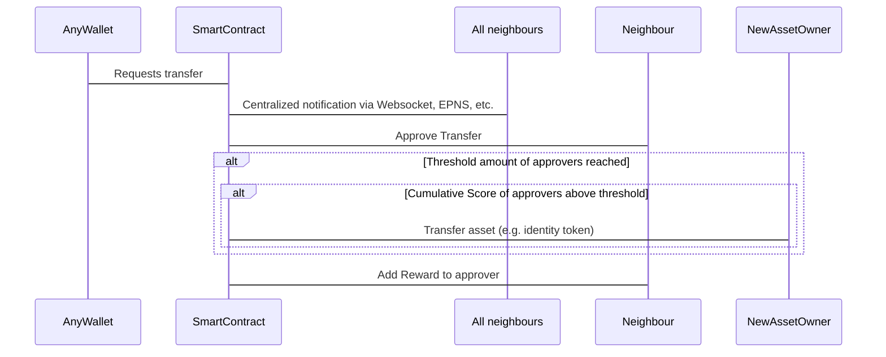

## 摘要

本 EIP 标准化了一种社交恢复机制，在该机制中，代币可以从一个无法访问的账户转移到一个新账户，前提是获得其他身份的足够批准。该批准不仅仅是技术性的，而是需要人类的干预。这些人类根据灵魂绑定代币提案被称为灵魂。当足够的灵魂给予他们的批准（这是一个是/否的决定）并达到阈值时，代币将从旧身份转移到新身份。

## 动机

一个已知的问题是账户的私钥可能会丢失。如果该密钥丢失，则无法恢复该账户拥有的代币。持有者将永远失去这些代币。除了直接伤害代币持有者外，代币本身的整个生态系统也会受到影响：丢失的代币越多，生态系统的自然增长和计划演变可用的代币就越少。

## 规范

```solidity

pragma solidity ^0.8.7;

interface ISocialRecovery {
    /// @dev Related but independent identity approves the transfer
    function approveTransfer(address from_, address to_) external;

    /// @dev User wants to move their onchain identity to another wallet which needs to be approved by n-nearest neighbour identities
    function requestTransfer(address from_, address to_) external payable;

    function addNeighbour(address neighbour_) external;

    function removeNeighbour(address neighbour_) external;
}
```

**其背后的数学**：

合规的合约应使用以下公式计算节点 n 的分数：

$$ score(n) = tanh({ { {\displaystyle\sum_{i = 1}^{|N|} } {log{(n_i^{r} {1 \over t - n_i^{t} + 1})}} \over{|N| + 1}} + n^{r}}) $$

其中：

$t$ 是当前时间（可以是任何时间标识值，如 `block.timestamp`、`block.number` 等）

$n^{r}$ 是节点 n 的奖励计数

$N$ 是 n 的邻居列表

$n_i^{r}$ 是来自 n 的邻居节点 i 的奖励计数

$n_i^{t}$ 是来自 n 的邻居节点 i 的最后时间戳（在该账户上预定奖励的时间）


**流程**：




## 理由

所提出的公式被认为非常稳健，并提供了一种连贯的激励结构，以便在链上分数中实际看到价值。该公式根据时间的分数添加权重，进一步有助于度量的公平性。 


## 安全考虑


1) 我们目前没有看到任何机制可以防止用户获得大量奖励。当然，高奖励与大量投资相关，但想要获得该奖励金额并且有足够资金的人将会实现。唯一可以改进的地方是，我们以某种方式找到真正识别与地址绑定的用户的机制。我们考虑过使用一种哈希机制，对一个可能模糊的现实世界对象进行哈希（当然！），并生成一个基于模糊集的相同哈希。

2) 我们实施了一个必须达到的阈值，以使社交代币转移成为可能。目前没有经验定义“好”或“坏”阈值，因此我们尝试找到第一个值。这可以或必须根据未来的经验进行调整。

3) 我们看到的另一个问题是邻居网络不再活跃，无法达到必要的最低阈值。这意味着由于无法达到最低批准数量，用户在想要执行的社交代币转移中被卡住。因此，合约依赖于其使用情况，如果它不再被使用，它将变得无用。

## 版权

版权及相关权利通过 [CC0](../LICENSE.md) 放弃。