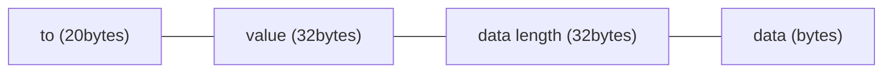

## 摘要
批量调用编码（BCE）概述了一种解决方案，旨在使智能合约账户（SCA）钱包能够将多个调用合并为一个调用，将多个参数编码为字节，压缩链上数据，并节省 gas。它可以用于实现原子操作以及非原子操作。

## 动机
通常，用户与合约之间的交互涉及一系列连贯的操作，例如 `approve`-`transferFrom`。虽然 EOA 钱包要求用户依次确认每个操作，但 SCA 钱包可以通过一次确认来确认所有操作，在一次调用中完成所有操作，从而实现原子性。如果 `approve` 成功但 `transferFrom` 失败，则会带来安全风险。安全的方法是确保如果一个操作失败，所有相关操作也失败，从而确保原子性。因此，我们提出这种编码方法，将多个参数编码为字节，压缩链上数据，并节省 gas。它可以用于实现原子和非原子操作。

除了上述提到的 `approve`-`transferFrom` 的原子操作外，还可以实现 gas 支付委托。这涉及用户和打包者签署一组调用，其中调用的内容包括：

1. 用户希望通过他的 SCA 发起多个调用。
2. 用户将 10 USDT 转移给打包者作为费用，包含在调用中。
3. 打包者提交调用，支付 ETH gas 并获得 10 USDT。

用户编码调用的内容，附上他们的签名以确保其完整性，并将其发送给打包者。如果打包者认为 gas 支付不足，他们可以选择不提交。然而，如果他们批准调用的内容，则可以提交签名的交易。执行后，用户获得所需的操作，打包者收到费用。

[EIP-4337](./eip-4337.md) 也实现了 gas 支付委托。BCE 和 [EIP-4337](./eip-4337.md) 并不相互排斥，可以在 SCA 中同时实现。

根据经验测试，BCE 比替代方法更简单且更节省 gas。

## 规范
本文档中的关键字 "MUST"、"MUST NOT"、"REQUIRED"、"SHALL"、"SHALL NOT"、"SHOULD"、"SHOULD NOT"、"RECOMMENDED"、"NOT RECOMMENDED"、"MAY" 和 "OPTIONAL" 应按 RFC 2119 和 RFC 8174 中的描述进行解释。

本 ERC **要求** 在合约中实现 SCA，其中 Dapp 与 SCA 钱包扩展进行通信，以传达用户的意图给钱包，钱包使用批量调用编码将多个调用作为字节发送到用户的 SCA 合约。

_批量调用_ 包含多个 `Call` 字节，每个字节由 `to`\`value`\`data` 的编码定义如下：



设：
- `to`：被调用合约的地址，对应于 Solidity 地址类型，20 字节。
- `value`：发送到合约的 ETH 数量（以 wei 为单位），对应于 Solidity uint 类型，32 字节。
- `data length`：数据的长度（以字节为单位），对应于 Solidity uint 类型，32 字节。
- `data`：发送到合约的编码函数数据，对应于 Solidity bytes 类型，长度由 `data length` 定义。

多个 `Call` 单元连接形成一个 _批量调用_ 序列。

## 理由
每个调用封装了 3 个参数：`to`\`value`\`data`。传统方法涉及将这 3 个参数打包到一个结构体中，然后将多个结构体放入一个数组中。然而，使用结构体会增加开销，因为它还打包了 `to`\`value`\`data` 的类型，增加了编码的大小。由于 `to`\`value`\`data` 具有固定类型，因此可以省略这额外的编码。在 Solidity 中，使用切片从 `bytes calldata` 中读取数据是一种节省 gas 的方法。考虑到这些因素，_批量调用编码_ 可以压缩链上数据并节省 gas。

## 向后兼容性
本 ERC 不改变共识层，因此对以太坊整体没有向后兼容性问题。

本 ERC 不改变其他 ERC 标准，因此对以太坊应用程序没有向后兼容性问题。

## 参考实现
本提案仅指定 _批量调用_ 的编码，而具体实现和命名则留给项目自行决定。以下是一个利用 _批量调用_ 的 SCA 合约示例（称为 `atomCallbytes`），用户原子性地签署多个操作，使打包者能够代表用户支付 gas：

### `SmartWallet.sol`

```solidity
pragma solidity ^0.8.0;

import "@openzeppelin/contracts/utils/cryptography/ECDSA.sol";

contract SmartWallet {
    using ECDSA for bytes32;

    uint32 public valid = 1; //to make AtomSign invalid

    address private immutable original;
    address public owner;
    address public bundler;

    mapping(bytes32 => bool) public usedMsgHashes;

    modifier onlyBundler() {
        require(
            bundler == msg.sender,
            "onlyBundler: caller is not the bundler"
        );
        _;
    }

    modifier onlyOwnerAndOriginal() {
        require(
            owner == msg.sender || original == msg.sender,
            "onlyOwnerAndOriginal: caller is not the owner"
        );
        _;
    }

    constructor(address _bundler) {
        original = address(this);
        owner = msg.sender;
        bundler = _bundler;
    }

    function atomSignCall(
        bytes calldata atomCallbytes,
        uint32 deadline,
        bytes calldata signature
    ) external onlyBundler {
        require(deadline >= block.timestamp, "atomSignCall: Expired");
        bytes32 msgHash = keccak256(
            bytes.concat(
                msg.data[:msg.data.length - signature.length - 32],
                bytes32(block.chainid),
                bytes20(address(this)),
                bytes4(valid)
            )
        );
        require(!usedMsgHashes[msgHash], "atomSignCall: Used msgHash");
        require(
            owner == msgHash.toEthSignedMessageHash().recover(signature),
            "atomSignCall: Invalid Signature"
        );

        //do calls
        uint i;
        while(i < atomCallbytes.length) {
            address to = address(uint160(bytes20(atomCallbytes[i:i+20])));
            uint value = uint(bytes32(atomCallbytes[i+20:i+52]));
            uint len = uint(bytes32(atomCallbytes[i+52:i+84]));

            (bool success, bytes memory result) = to.call{value: value}(atomCallbytes[i+84:i+84+len]);
            if (!success) {
                assembly {
                    revert(add(result, 32), mload(result))
                }
            }

            i += 84 + len;
        }

        usedMsgHashes[msgHash] = true;
    }

    /**
     * if you signed something then regretted, make it invalid
     */
    function makeAtomSignInvalid() public onlyOwnerAndOriginal {
        valid = uint32(uint(blockhash(block.number)));
    }
}
```

### `Bundler.sol`

```solidity
pragma solidity ^0.8.0;

contract Bundler {

    address public owner;

    modifier onlyOwner() {
        require(
            owner == msg.sender,
            "onlyOwner: caller is not the owner"
        );
        _;
    }

    constructor() {
        owner = msg.sender;
    }

    function executeOperation(
        address wallet,
        bytes calldata data
    ) public onlyOwner {
        (bool success, bytes memory result) = _callTo.call{value: 0}(data);

        if (!success) {
            assembly {
                revert(add(result, 32), mload(result))
            }
        }
    }
}
```

## 安全考虑
本提案引入了一种数据编码方案，旨在进行数据压缩。它仅涉及数据压缩，不会导致数据丢失或隐私数据的隐藏。

## 版权
版权及相关权利通过 [CC0](../LICENSE.md) 放弃。